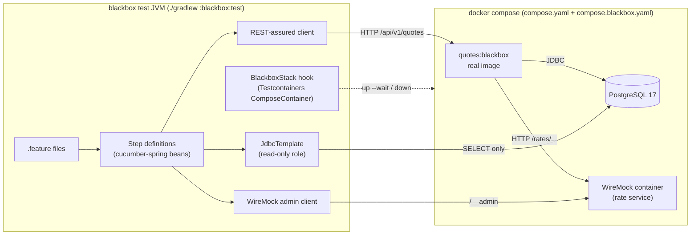

# Plan: black-box testing with Cucumber

Replace the in-JVM system tier (`src/systemTest`) with a black-box suite that starts the **real
Docker image** of the service and tests it only over HTTP. The suite is written in Java with
Cucumber, so the team keeps its usual toolchain, and it uses Spring (`cucumber-spring`) for the
suite's own dependency injection. The application's Spring context is never loaded in the test
JVM.

Unit and integration tiers stay exactly where they are. Only the top of the pyramid moves.

## Decisions

| Topic | Decision |
| --- | --- |
| Location | New Gradle subproject `blackbox/` in this repo, with **no dependency on the app's code** |
| Test language | Java 21, Cucumber-JVM (JUnit Platform engine), REST-assured, AssertJ |
| DI in steps | `cucumber-spring` with a small test-only Spring config (not the application context) |
| Environment | Local `docker compose` stack: app image + PostgreSQL + WireMock |
| Stack lifecycle | Testcontainers `ComposeContainer`, started once per test run from a Cucumber hook |
| Rate service | WireMock **container**, programmed by steps through its admin API |
| Database access | **Read-only SQL for assertions only**, via a SELECT-only Postgres role. Setup goes through the API |
| Old system tier | Removed: `src/systemTest`, `FullStackTest`, `SystemTestBase`, `RateServiceStub` |
| Feature authors | Developers and QA. Steps may be technical where that makes them clearer |
| Performance | Gatling (Java DSL) smoke test against the same stack |
| CI | Two parallel jobs, both required: unit + integration, and black-box |

## Target architecture



The only things shared between the service and the tests are the HTTP contract, the database
schema (read-only), and the compose files.

## Repository layout after the change

```
.
├── build.gradle.kts            # app: unit + integration tiers only; systemTest suite removed
├── settings.gradle.kts         # include("blackbox")
├── Dockerfile                  # NEW: layered Spring Boot image of the app
├── compose.yaml                # dev: postgres (unchanged, reused as the base file)
├── compose.blackbox.yaml       # NEW: overlay adding app + wiremock, plus the reader role
├── docker/postgres-init/
│   └── 01-blackbox-reader.sql  # NEW: SELECT-only role for assertions
├── src/                        # app, test, integrationTest, testFixtures (systemTest deleted)
└── blackbox/
    ├── build.gradle.kts
    └── src/
        ├── main/java/com/example/quotes/blackbox/stack/
        │   └── BlackboxStack.java          # shared by Cucumber and Gatling
        ├── test/java/com/example/quotes/blackbox/
        │   ├── RunCucumberTest.java        # JUnit Platform suite entry point
        │   ├── config/BlackboxConfig.java  # @CucumberContextConfiguration + beans
        │   ├── support/                    # ScenarioContext, JsonAssertions, RateStub, QuoteDb
        │   └── steps/                      # QuoteSteps, RateServiceSteps, PersistenceSteps
        ├── test/resources/
        │   ├── junit-platform.properties
        │   └── features/quotes/            # *.feature
        └── gatling/java/com/example/quotes/blackbox/perf/
            └── QuoteSmokeSimulation.java
```

## Components

### 1. The application image

- Add a `Dockerfile` that uses Spring Boot's layered jar (`java -Djarmode=tools -jar app.jar
  extract --layers`) on `eclipse-temurin:21-jre`. It rebuilds faster than `bootBuildImage` and CI
  can cache it.
- A Gradle `Exec` task `:dockerImage` runs `docker build -t quotes:blackbox .`, with `bootJar` as
  its input. `:blackbox:test` depends on it.
- The image is configured **only** through environment variables, the same way production would
  be.

### 2. Compose files

`compose.yaml` stays the dev database. `compose.blackbox.yaml` is an overlay (`docker compose -f
compose.yaml -f compose.blackbox.yaml`) that adds:

```yaml
services:
  postgres:
    volumes:
      - ./docker/postgres-init:/docker-entrypoint-initdb.d:ro
  wiremock:
    image: wiremock/wiremock:3.13.1
    healthcheck: { test: ["CMD", "curl", "-f", "http://localhost:8080/__admin/health"] }
  app:
    image: quotes:blackbox
    depends_on:
      postgres: { condition: service_healthy }
      wiremock: { condition: service_healthy }
    environment:
      SPRING_DATASOURCE_URL: jdbc:postgresql://postgres:5432/quotes
      APP_RATE_BASE_URL: http://wiremock:8080
    healthcheck: { test: ["CMD", "curl", "-f", "http://localhost:8080/actuator/health/readiness"] }
```

No host ports are fixed. Testcontainers maps them dynamically, so black-box runs never collide
with a dev stack on 5432.

### 3. Read-only database role

`docker/postgres-init/01-blackbox-reader.sql` runs when the container is first created, before
Flyway. The default privileges make sure tables created later by Flyway are readable too:

```sql
CREATE ROLE blackbox_reader LOGIN PASSWORD 'blackbox_reader';
GRANT CONNECT ON DATABASE quotes TO blackbox_reader;
GRANT USAGE ON SCHEMA public TO blackbox_reader;
ALTER DEFAULT PRIVILEGES FOR ROLE quotes IN SCHEMA public GRANT SELECT ON TABLES TO blackbox_reader;
```

Rules for steps:
- SQL appears **only in `Then` steps**, only through the `QuoteDb` support class.
- Any write attempt fails at the database level because the role has no write privileges. This
  is enforced by Postgres, not by convention.
- Prefer asserting through the API. Use SQL only for what the API cannot show, such as "nothing
  was persisted" or "the stored scale is 4".

### 4. Stack lifecycle: `BlackboxStack`

A small class in `blackbox/src/main` wraps Testcontainers `ComposeContainer`:
- It points at both compose files and uses local compose mode, which runs the `docker compose`
  CLI on the host.
- It waits for each service's healthcheck, then exposes `baseUrl()`, `wiremockAdminUrl()` and
  `jdbcUrl()` using the mapped ports.
- It starts lazily and only once per JVM, and stops from a shutdown hook, the same singleton
  pattern as `PostgresContainer` today.
- A Cucumber `@BeforeAll` hook triggers it. Gatling's `before()` uses the same class.

### 5. Cucumber wiring

`blackbox/build.gradle.kts` (sketch):

```kotlin
plugins { java; id("io.gatling.gradle") version "<current>" }

dependencies {
    implementation(platform("org.springframework.boot:spring-boot-dependencies:4.1.1"))
    implementation("org.testcontainers:testcontainers")          // BlackboxStack

    testImplementation(platform("io.cucumber:cucumber-bom:<current>"))
    testImplementation("io.cucumber:cucumber-java")
    testImplementation("io.cucumber:cucumber-spring")
    testImplementation("io.cucumber:cucumber-junit-platform-engine")
    testImplementation("org.junit.platform:junit-platform-suite")
    testImplementation("org.springframework:spring-context")
    testImplementation("org.springframework:spring-jdbc")
    testImplementation("io.rest-assured:rest-assured")
    testImplementation("org.wiremock:wiremock")                  // admin client only
    testImplementation("org.assertj:assertj-core")
    testImplementation("net.javacrumbs.json-unit:json-unit-assertj:<current>")
    testRuntimeOnly("org.postgresql:postgresql")
    // Deliberately NO project(":") dependency - see guard below.
}

tasks.test {
    useJUnitPlatform()
    dependsOn(":dockerImage")
    failOnNoDiscoveredTests = true
    systemProperty("cucumber.filter.tags", providers.gradleProperty("tags").getOrElse("not @wip"))
}
```

- **`RunCucumberTest`** uses `@Suite`, `@IncludeEngines("cucumber")` and
  `@SelectClasspathResource("features")`.
- **`junit-platform.properties`** sets the glue package and the plugins: `pretty`,
  `html:build/reports/cucumber/index.html` and `junit:build/test-results/cucumber.xml`.
- **`BlackboxConfig`** is annotated `@CucumberContextConfiguration` and `@ContextConfiguration`
  on a plain `@Configuration`. Its beans are `RequestSpecification` (REST-assured, base URL from
  `BlackboxStack`), `WireMock` (admin client), `JdbcTemplate` (reader role, `setReadOnly(true)`
  on the DataSource) and the support classes. This is the "Spring ecosystem" part: familiar DI,
  `@Autowired` in step classes, but no Boot application context.
- **`ScenarioContext`** is `@ScenarioScope` and holds the last response, the created quote id, and
  a unique `customerId` per scenario.

### 6. Test isolation

- **Data:** every scenario generates its own `customerId` (`bb-<uuid>`). Rows are never deleted.
  Scenarios assert only on their own data, so leftovers from earlier scenarios can't cause
  failures.
- **Stubs:** WireMock stubs are global to the container. A `@Before` hook calls
  `WireMock.resetAllRequests()` and `resetMappings()`, and scenarios run **serially**.
- **Parallelism later:** if the suite gets slow, give each scenario a unique product code
  (`BB-<n>`) so stubs never overlap, then enable `cucumber.execution.parallel.enabled`.

### 7. Step vocabulary

Keep a small, shared set of steps. It is documented in `blackbox/README.md` and grows through
review rather than per test. Example feature:

```gherkin
Feature: Create a quote

  Background:
    Given the rate service quotes 4.25% for product "WIDGET" in "USD"

  Scenario: A valid command is priced with the upstream rate and persisted
    When I request a quote:
      | productCode | amount   | currency | termMonths |
      | WIDGET      | 10000.00 | USD      | 12         |
    Then the response status is 201
    And the response has a Location header pointing at the new quote
    And the quote total is 10425.00
    And the stored quote has total 10425.0000 and rate 4.2500

  Scenario: A created quote reads back exactly as it was returned
    When I request a quote for 10000 USD over 12 months of product "WIDGET"
    And I fetch that quote
    Then the fetched JSON equals the created JSON
```

```gherkin
Feature: Rate service failures

  Scenario Outline: An upstream failure is reported as 503 and nothing is saved
    Given the rate service answers <status> for product "WIDGET"
    When I request a quote for 1000 USD over 12 months of product "WIDGET"
    Then the response is a problem of type "urn:problem:rate-unavailable" with status 503
    And no quote is stored for my customer

    Examples:
      | status |
      | 500    |
      | 503    |

  Scenario: A slow rate service times out
    Given the rate service takes 5 seconds to answer for product "WIDGET"
    When I request a quote for 1000 USD over 12 months of product "WIDGET"
    Then the response status is 503
```

Step implementation shape:

```java
public class QuoteSteps {

    @Autowired private RequestSpecification api;
    @Autowired private ScenarioContext scenario;

    @When("I request a quote for {bigdecimal} {word} over {int} months of product {string}")
    public void requestQuote(BigDecimal amount, String currency, int termMonths, String product) {
        scenario.response(given(api)
                .contentType(ContentType.JSON)
                .body(Map.of("customerId", scenario.customerId(), "productCode", product,
                        "amount", amount, "currency", currency, "termMonths", termMonths))
                .post("/api/v1/quotes"));
    }

    @Then("the quote total is {string}")
    public void quoteTotalIs(String expected) {
        // Compare the raw JSON token so the number's scale is checked, not just its value.
        assertThatJson(scenario.response().asString()).node("total").isEqualTo(new BigDecimal(expected));
    }
}
```

Assertions read **raw JSON**, never the app's `QuoteResponse` type, because the blackbox module
can't see it. That independence is what catches contract drift.

### 8. Guards

- **No app code on the classpath.** A `verifyBlackboxIsolation` task fails if `blackbox`'s
  configurations contain any project dependency, or if `com.example.quotes.quote` classes show up
  on its classpath. This replaces the old "system tier cannot see JPA" argument with a real check.
- **`failOnNoDiscoveredTests`** stays on, and Cucumber `strict` mode is on by default, so undefined
  or pending steps fail the run.
- The `@wip` tag is excluded by default. Its use should be temporary and visible in review.

### 9. Performance smoke (Gatling)

- A `gatling` source set in `blackbox/` holds `QuoteSmokeSimulation` (Java DSL), which uses
  `BlackboxStack` in `before()` and `after()`.
- The scenario stubs a rate once, then runs about 20 users for 60 s doing create → fetch.
- Assertions: 0% errors, p95 below 300 ms, p99 below 800 ms. This is a smoke test that catches
  pathologies such as a missing connection pool, N+1 queries or a timeout misconfiguration. It is
  not a benchmark.
- Run it with `./gradlew :blackbox:gatlingRun`. In CI it runs **nightly and on manual dispatch**,
  not on every PR, because shared runners make latency numbers too noisy to block merges.

## Changes to the existing build

1. `settings.gradle.kts`: add `include("blackbox")`.
2. `build.gradle.kts`:
   - Delete the `systemTest` suite, `systemTestTask` and the `restclient-test` dependency.
   - Remove `systemTest` from `verifyContextBudget`'s suite list, `coverageSuites` and the
     `shouldRunAfter` chain.
   - Add the `:dockerImage` task.
   - Make root `check` depend on `:blackbox:test`, so local `./gradlew check` still runs
     everything.
3. Delete `src/systemTest/**` and `src/testFixtures/.../testsupport/RateServiceStub.java`. Only
   the system tier uses `RateServiceStub`; `HttpRateGatewayTest` starts its own `WireMockServer`.
4. **Close the coverage gap before deleting the system tier.** Today `findQuote` and
   `GET /api/v1/quotes/{id}` are covered only by system tests. Add a `QuoteServiceTest` case for
   found and not-found, and a `@WebMvcTest` case for GET 200/404, or the 85% gate will likely
   fail.
5. Delete `src/testFixtures/resources/golden/quote-response.json`. The `wire_contract.feature`
   replaces it, asserting exact JSON (including scale) through JsonUnit.
6. Update `README.md` and `docs/TEST-ARCHITECTURE.md`, which already contain stale claims (the
   "four tiers" heading and CI "runs both jobs").

## CI

`.github/workflows/ci.yml` gets two jobs that run in parallel, both required to merge:

| Job | Command | Uploads |
| --- | --- | --- |
| `unit-and-integration` | `./gradlew check -x :blackbox:test` | test + JaCoCo reports |
| `blackbox` | `./gradlew :blackbox:test` | Cucumber HTML report, container logs printed by `BlackboxStack` when the stack fails to start |

A separate `perf-smoke.yml` runs `./gradlew :blackbox:gatlingRun` nightly and on
`workflow_dispatch`, and uploads the Gatling report.

## Phases

| # | Work | Done when |
| --- | --- | --- |
| 1 | `Dockerfile`, `:dockerImage`, `compose.blackbox.yaml`, reader role | `docker compose -f compose.yaml -f compose.blackbox.yaml up --wait` gives a healthy app that answers `POST /api/v1/quotes` using a manually created stub |
| 2 | `blackbox/` module, `BlackboxStack`, Cucumber + Spring wiring, one walking-skeleton scenario | `./gradlew :blackbox:test` builds the image, starts the stack, passes 1 scenario, and tears everything down |
| 3 | Port every system test to features: create, fetch, 404, validation 400 (no upstream call), 503 variants, timeout, wire contract | Every scenario in `src/systemTest` has an equivalent, and the report is published |
| 4 | Coverage gap tests (item 4 above), then delete the system tier and its plumbing | `./gradlew check` is green with the 85% gate intact |
| 5 | Isolation guard, step-vocabulary README, CI split | Both CI jobs are green and required |
| 6 | Gatling smoke + nightly workflow | The nightly run is green and the report is uploaded |

## Expected findings

The black-box suite compares raw JSON, so it will likely **fail** on bugs the current suite hides:

- **POST vs GET differ:** the POST response echoes the request's number scale (`10000.00`), while
  GET returns the stored scale (`10000.0000`). `createdAt` precision can also differ (nanoseconds
  vs microseconds).
- **Server error on valid input:** amounts near the validation limit overflow `NUMERIC(19,4)` and
  return a 500.
- **Wrong error for an unknown product:** a 404 from the rate service is reported as 503 "retry
  later".

Add these as scenarios tagged `@known-bug` (excluded like `@wip`), and fix them in follow-up
changes so the suite doesn't start life red.

## Risks and open points

- **Speed:** building the image and starting the stack adds roughly 30–60 s per run. That's
  acceptable for a separate CI job. Locally, `-Pblackbox.reuse=true` could keep the stack up
  between runs using Testcontainers reuse (optional, phase 5+).
- **Docker compose v2 is required** on developer machines and runners. GitHub's `ubuntu-latest`
  has it, and OrbStack or Docker Desktop provide it locally.
- **WireMock stubs are global,** so scenarios must stay serial until per-scenario product codes are
  introduced.
- **Duplicate step definitions:** Cucumber fails on ambiguous steps, and the shared vocabulary in
  `blackbox/README.md` keeps them from spreading.
